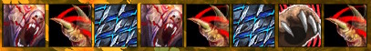
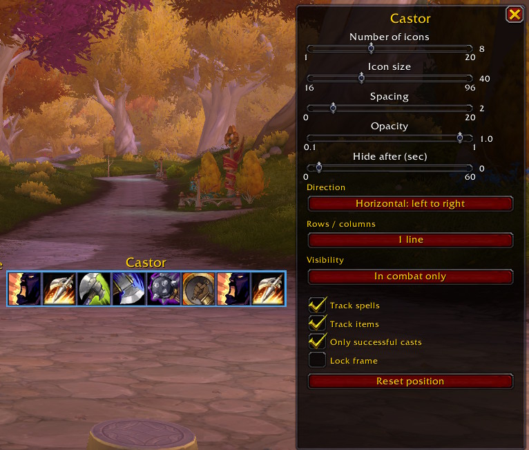

# Castor

A World of Warcraft Retail addon that tracks the player's recent actions
(spells and items) and displays them as a customizable icon strip.

Castor was built to address two limitations of similar trackers: the inability
to control **when** the display appears, and the inability to **lay it out**
the way you want.

## Features

- Tracks player spell casts (`UNIT_SPELLCAST_SENT` / `UNIT_SPELLCAST_SUCCEEDED`)
- Tracks item uses (potions, trinkets, consumables)
- Configurable layout: horizontal or vertical, on 1 or 2 lines/columns
- Configurable icon size, spacing, opacity, and auto-hide delay
- Visibility tied to combat state: always / in combat only / out of combat
- **Native Edit Mode integration**: configure Castor inside WoW's built-in
  Edit Mode — the configuration panel anchors itself next to the frame
  and snaps to keep itself on screen
- Per-character saved settings

## Installation

1. Clone or download this repository.
2. Place the `Castor` folder under
   `World of Warcraft/_retail_/Interface/AddOns/`.
3. Restart WoW or `/reload`.

## Usage

| Command           | Effect                                                   |
|-------------------|----------------------------------------------------------|
| `/castor`         | Toggle Castor's edit mode (config panel + drag handle)   |
| `/castor lock`    | Lock the frame in place                                  |
| `/castor unlock`  | Unlock the frame for dragging                            |
| `/castor reset`   | Reset the frame to its default position                  |

You can also configure Castor by entering WoW's native Edit Mode — the
config panel automatically appears next to the Castor frame.

## Architecture

The addon is split into single-purpose Lua modules with no external
dependencies:

| File             | Responsibility                                       |
|------------------|------------------------------------------------------|
| `Castor.lua`     | Entry point, namespace, slash commands               |
| `Config.lua`     | Defaults and persistent settings (`SavedVariables`)  |
| `Display.lua`    | Frame, icon pool, grid layout                        |
| `Tracker.lua`    | Spell and item event capture                         |
| `Visibility.lua` | Combat-state-driven show/hide                        |
| `Options.lua`    | Floating configuration panel                         |
| `EditMode.lua`   | Hooks into WoW's Edit Mode lifecycle                 |

## License

MIT.
